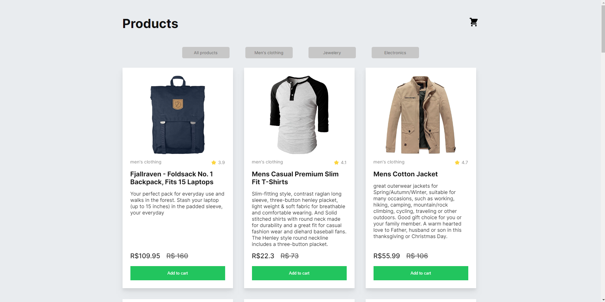
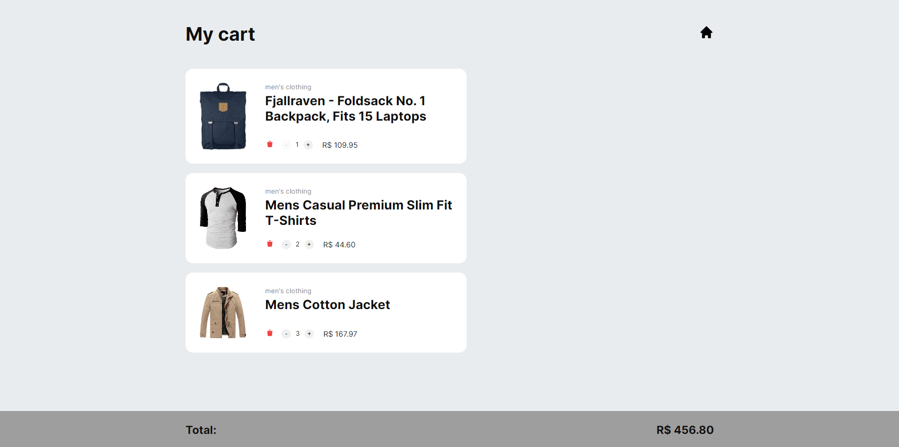

# Carrinho de compras

Bem-vindos ao repo do meu novo projeto sobre "carrinho de compras".




## Resumo

**Ideia:** Desenvolver todo o mecanismo de um carrinho de compras de um e-commerce.</br>
**Duração:** 3 dias.</br>
**Desafios:** Atualizar o valor do carrinho ao: Diminuir a quantidade de produtos, ao excluir e adicionar um produto.</br>
**Tecnologias:** React.js, Typescript e Redux.

## Desenvolvimento

Esse projeto foi bem simples e divertido de ser desenvolvido. Ele foi dividido nas seguintes partes:

1. Fazer requisição dos Produtos
2. Adicionar ao carrinho
3. Definir quantidade dos produtos
4. Excluir produto
5. Atualizar valor total a cada interação.

## 1. API
Para os produtos usei uma API criado por MohammadReza Keikavousi chamada "Fake Store API".

Começamos criando uma instância com o Axios.
```ts
import axios, {AxiosInstance} from 'axios';

const api: AxiosInstance = axios.create({
  baseURL: 'https://fakestoreapi.com',
  headers: {
    'Content-Type': 'application/json',
  },
});

export default api;
```
Depois retornamos os produtos na página.

```ts
const [products, setProducts] = useState<DataProps[]>([]);

useEffect(() => {
  api.get('/products')
    .then((res) => setProducts(res.data))
    .catch((err) => console.log(err))
}, []);

return (
  {listProducts.map((item) => (
    <Product key={item.id} {...item}/>
  ))}
)
```

## 2. Adicionar ao carrinho
Para adicionar ao carrinho fazemos um `dispatch()` do item para um array de objetos no gerenciamento do estado (Redux) e isso adiciona o produto a esse estado que irá ser retornado na página de carrinho de compras.

```ts
const addProduct = (infos: DataProps): void => {
  dispatch(addProductsCartReducer(infos));
};

return (
  <Button onClick={() => addProduct(props)}>Add to cart</Button>
)
```

## 3. Definir quantidade dos produtos
Para configurar a quantidade de cada produto criei um `useState()` para ir atualizando o valor e a quantidade de itens.
Depois crio uma variável para o valor que fica no produto. Ele é atualizado com a quantidade de itens que o usuário escolheu.

```ts
  const [amount, setAmount] = useState<number>(1);
  const priceProduct: number = product.price * amount;
```

Para a gente adicionar a quantidade, fiz uma função para cada botão que atualiza o estado `amount` e adiciona/remove o preço do carrinho.

```ts
const amountMorePrice = () => {
  dispatch(totalPriceCartReducer(product.price));
  setAmount(prev => prev + 1);
};

const amountLessPrice = () => {
  dispatch(lessPriceCartReducer(product.price));
  setAmount(prev => prev - 1);
};

return (
  <button disabled={amount <= 1 ? true : false} onClick={amountLessPrice}>-</button>
  <span>{amount}</span>
  <button onClick={amountMorePrice}>+</button>
)
```

## 4. Excluir produto
A exclusão do produto é feito por um Reducer, ja que os produtos estão sendo gerenciados pelo Redux. Para isso fazemos simplismente um `filter()` que nos retorna um novo array, so que sem o produto excluido.

```ts
removeProductsCart: (state, action: PayloadAction<number>): DataProps[] => {
  return state.filter((_, index) => index !== action.payload);
} 
```

## 5. Atualizar valor total a cada interação.
Para o valor do carrinho é adicionado ou removido conforme a etapa 3, e tudo é gerenciado pelo reducer.

```ts
totalPriceCartReducer: (state, {payload}: PayloadAction<number>): number[] => [...state, payload],
```

# Obrigado,
Chegamos ao fim de mais um projeto feito com Typescript e Redux. 
Até os proximos capítulos.
